# Azure File Upload Architecture Diagram

```mermaid
graph TB
    subgraph "Internet"
        User[👤 User]
    end

    subgraph "Azure Subscription"
        subgraph "Resource Group: rg-fileupload-demo"
            
            subgraph "Virtual Network: vnet-file-dev-xxxxx<br/>10.0.0.0/16"
                
                subgraph "App Service Subnet<br/>10.0.1.0/24<br/>Delegated to Microsoft.Web/serverFarms"
                    AppService[🌐 App Service<br/>app-file-dev-xxxxx<br/>ASP.NET Core 8.0 / Python 3.11<br/>B1 SKU]
                end
                
                subgraph "Private Endpoint Subnet<br/>10.0.2.0/24"
                    PE[🔒 Private Endpoint<br/>pe-stfiledev-xxxxx<br/>IP: 10.0.2.4]
                end
            end
            
            subgraph "Storage Resources"
                Storage[💾 Storage Account<br/>stfiledevxxxxx<br/>Standard_LRS<br/>Public Access: Disabled]
                BlobService[📦 Blob Service]
                Container[📁 Container: uploads<br/>Public Access: None]
                
                Storage --> BlobService
                BlobService --> Container
            end
            
            subgraph "App Service Plan"
                ASP[⚙️ App Service Plan<br/>plan-file-dev-xxxxx<br/>Linux B1]
            end
            
            subgraph "DNS Resources"
                PrivateDNS[🌍 Private DNS Zone<br/>privatelink.blob.core.windows.net]
                DNSRecord[📝 A Record<br/>stfiledevxxxxx → 10.0.2.4]
                VNetLink[🔗 VNet Link]
                
                PrivateDNS --> DNSRecord
                PrivateDNS --> VNetLink
            end
            
            subgraph "Identity & Access"
                MI[🔑 Managed Identity<br/>System-Assigned]
                RBAC[👮 RBAC Role<br/>Storage Blob Data Contributor]
                
                MI -.->|Assigned to| AppService
                RBAC -.->|Grants access| MI
            end
            
            ASP -.->|Hosts| AppService
        end
    end
    
    %% Connections
    User -->|HTTPS| AppService
    AppService -->|VNet Integration| PE
    PE -->|Private Connection| Storage
    VNetLink -.->|Links to| VirtualNetwork
    AppService -.->|Resolves via| PrivateDNS
    MI -->|Authenticates to| Storage
    
    %% Styling
    classDef userClass fill:#4CAF50,stroke:#333,stroke-width:2px,color:#fff
    classDef appClass fill:#2196F3,stroke:#333,stroke-width:2px,color:#fff
    classDef storageClass fill:#FF9800,stroke:#333,stroke-width:2px,color:#fff
    classDef networkClass fill:#9C27B0,stroke:#333,stroke-width:2px,color:#fff
    classDef securityClass fill:#F44336,stroke:#333,stroke-width:2px,color:#fff
    classDef dnsClass fill:#00BCD4,stroke:#333,stroke-width:2px,color:#fff
    
    class User userClass
    class AppService,ASP appClass
    class Storage,BlobService,Container storageClass
    class PE,VirtualNetwork networkClass
    class MI,RBAC securityClass
    class PrivateDNS,DNSRecord,VNetLink dnsClass
```



## Architecture Components

### 1. **Networking Layer** (`modules/network.bicep`)
- **Virtual Network**: 10.0.0.0/16 address space
  - **App Service Subnet** (10.0.1.0/24): Delegated to Microsoft.Web/serverFarms for VNet integration
  - **Private Endpoint Subnet** (10.0.2.0/24): Hosts private endpoint for storage access
- **Private DNS Zone**: `privatelink.blob.core.windows.net`
  - VNet Link: Connects DNS zone to VNet for name resolution
  - A Record: Maps storage account FQDN to private IP (10.0.2.4)

### 2. **Compute Layer** (`modules/appservice.bicep`)
- **App Service Plan**: Linux-based B1 SKU
- **App Service**: 
  - Runtime: .NET Core 8.0 (C#) or Python 3.11 (Flask)
  - HTTPS Only with TLS 1.2 minimum
  - VNet Integration enabled (routes all traffic through VNet)
  - Always On enabled
  - System-Assigned Managed Identity

### 3. **Storage Layer** (`modules/storage.bicep`)
- **Storage Account**:
  - SKU: Standard_LRS (Locally Redundant Storage)
  - Access Tier: Hot
  - Public Network Access: **Disabled**
  - Minimum TLS: 1.2
  - Blob Public Access: Disabled
- **Blob Service**: 7-day delete retention policy
- **Container**: "uploads" with no public access
- **Private Endpoint**: Connects storage to VNet privately

### 4. **Security Layer** (`modules/roleassignment.bicep`)
- **Managed Identity**: System-assigned to App Service
- **RBAC Role Assignment**: 
  - Role: Storage Blob Data Contributor
  - Scope: Storage Account
  - Principal: App Service Managed Identity
- **Authentication Flow**: App Service → Managed Identity → Storage Account (No keys/connection strings)

## Data Flow

1. **User Request**: User uploads file via HTTPS to App Service
2. **VNet Integration**: App Service routes request through integrated subnet (10.0.1.0/24)
3. **DNS Resolution**: App Service queries Private DNS Zone for storage account FQDN
4. **Private DNS Response**: Returns private IP (10.0.2.4) instead of public endpoint
5. **Private Connection**: Traffic routes through Private Endpoint in subnet 10.0.2.0/24
6. **Authentication**: App Service uses Managed Identity to authenticate (OAuth 2.0 token)
7. **Authorization**: Azure validates RBAC role (Storage Blob Data Contributor)
8. **File Upload**: Blob is uploaded to "uploads" container
9. **Response**: Success/error returned to user

## Security Features

### 🔒 Network Security
- ✅ Storage account **completely isolated** from internet
- ✅ All traffic flows through **private network**
- ✅ Private endpoint ensures **no public exposure**
- ✅ VNet integration routes **all outbound traffic** through VNet

### 🔑 Identity & Access
- ✅ **No connection strings or keys** in code/configuration
- ✅ Managed Identity provides **automatic credential rotation**
- ✅ Azure RBAC for **least-privilege access**
- ✅ Principle of **zero-trust** networking

### 🛡️ Transport Security
- ✅ HTTPS only (TLS 1.2 minimum)
- ✅ FTPS disabled
- ✅ HTTP/2 enabled for performance
- ✅ Storage requires HTTPS traffic only

## Multi-Application Architecture

For the Python Flask application, a **similar architecture** is deployed with:
- Separate VNet (`vnet-file-dev-lsxm5qbo`) with same address space (10.0.0.0/16)
- Separate App Service for Python runtime
- **Second Private Endpoint** in Python VNet (due to overlapping address spaces preventing VNet peering)
- Shared Storage Account (both apps write to same storage)
- Separate Managed Identities with same RBAC role assignments

### Why Two Private Endpoints?
- Both VNets use 10.0.0.0/16 address space (overlapping)
- VNet peering requires non-overlapping address spaces
- Solution: Create separate private endpoint in each VNet
- Both resolve to same storage account via separate Private DNS zones

## Deployment Order

1. **Resource Group** (Subscription-level)
2. **Virtual Network** with subnets and Private DNS Zone
3. **Storage Account** with Private Endpoint and DNS registration
4. **App Service Plan** and App Service with VNet Integration
5. **Role Assignment** granting Managed Identity access to Storage

All components are deployed via **Infrastructure as Code (Bicep)** with modular design for reusability.

---

**Deployment Command:**
```powershell
az deployment sub create \
  --location eastus \
  --template-file infra/main.bicep \
  --parameters infra/main.bicepparam
```
